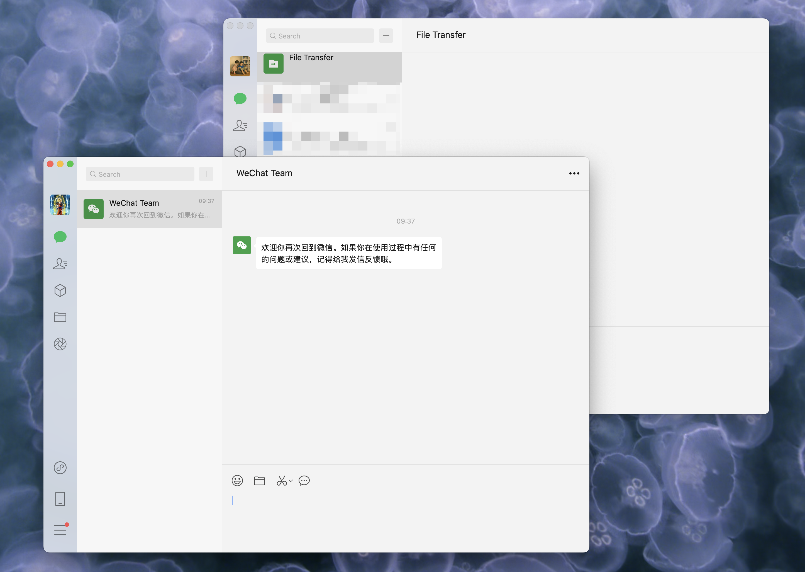

# Multi WeChat Mac

Run multiple WeChat instances on macOS. 

Credit goes to this X thread: https://x.com/wlzh/status/1958095264981581962




Usage:
1. Download `multi-wechat-mac.py` to a dir on your Mac.
2. [Optional] Review the script content to ensure it's safe for you.
3. Open `Terminal.app`, cd to the dir, run it:
```
# if script is downloaded into this dir
cd ~/Downloads/

# create WeChat2 by default
python3 multi-wechat-mac.py

# create WeChat3
python3 multi-wechat-mac.py -n WeChat3
```
4. Open new WeChat app and login.